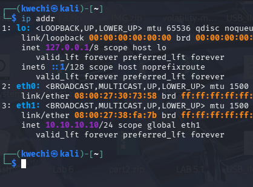
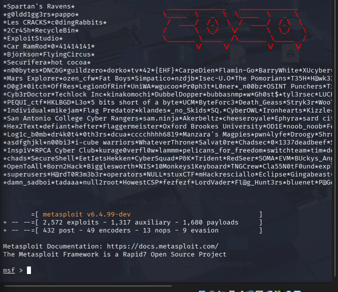
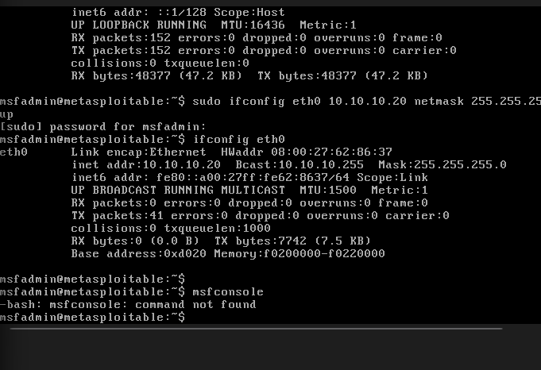

## Lab Evidence

### Kali Network Configuration

The Kali Linux analysis machine was configured with a dedicated lab interface (`eth1`) using the private IPv4 address `10.10.10.10/24`.

### Security Testing Environment

Metasploit Framework was launched within Kali Linux as part of the isolated security-testing environment.

### Metasploitable Target Configuration

The Metasploitable target system was configured on the same isolated `10.10.10.0/24` network using the address `10.10.10.20`.

> All security testing shown in this project was performed within an isolated, personally controlled virtual lab environment.
